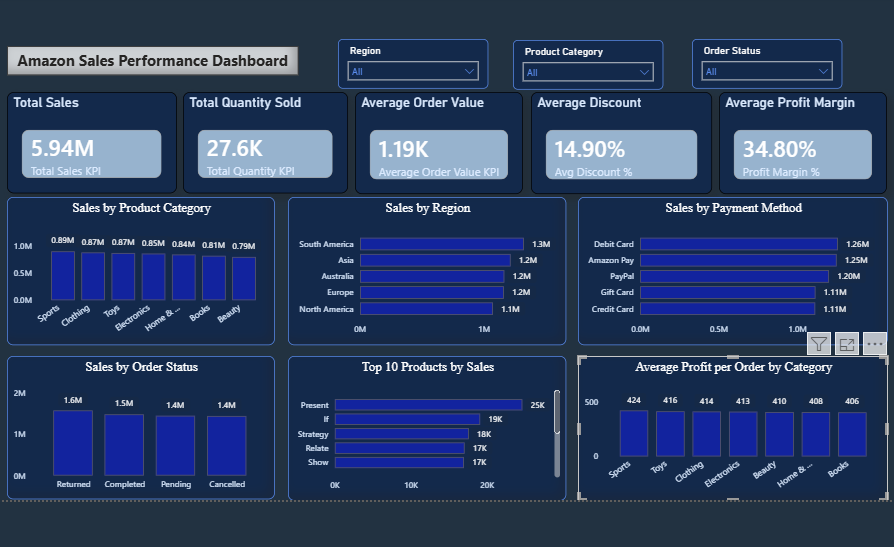
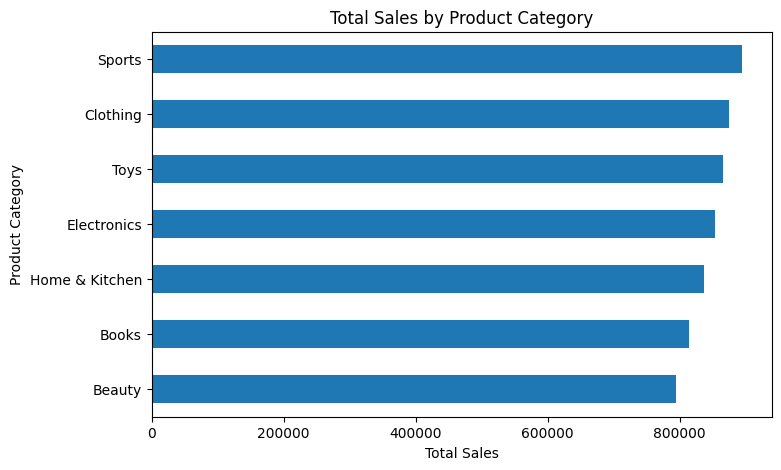
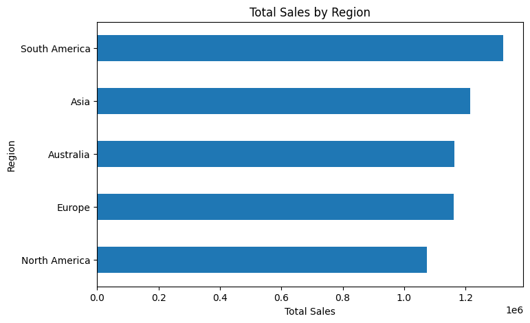
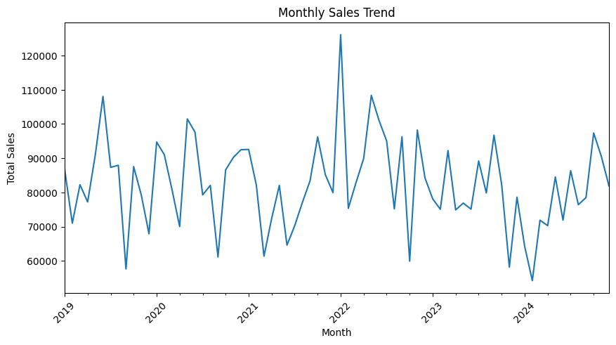
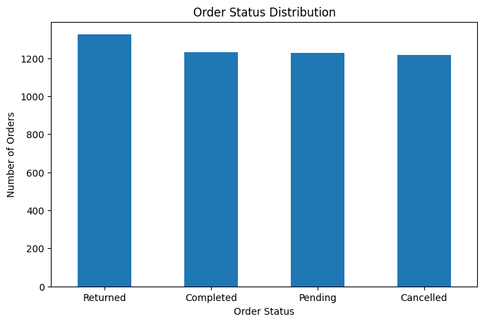
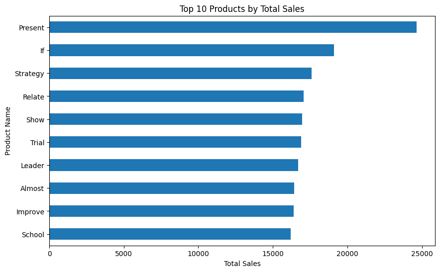
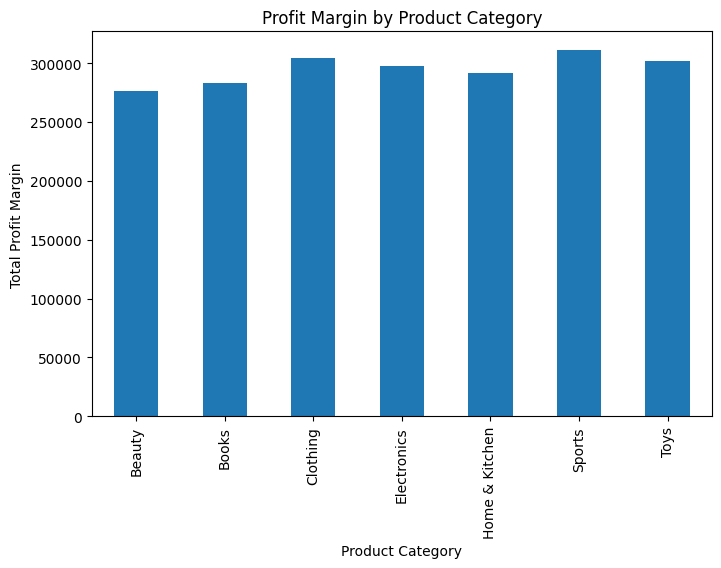

# Amazon Sales Analysis | Python & Power BI

## 📊 Project Overview

An end-to-end data analytics project analyzing Amazon sales data using Python and Power BI.

The project focuses on sales performance, product categories, regions, order status, and profitability to generate meaningful business insights.

## 🛠️ Tools & Technologies

- Python
- Pandas
- NumPy
- Matplotlib
- Seaborn
- Power BI
- Google Colab

## 🔍 Analysis Performed

- Data cleaning and preprocessing
- Exploratory Data Analysis (EDA)
- Sales performance analysis
- Product category analysis
- Regional sales analysis
- Order status analysis
- Top product analysis
- Profit margin analysis
- Monthly sales trend analysis

## 📈 Power BI Dashboard

The interactive dashboard includes:

- Total Sales
- Total Quantity Sold
- Average Order Value
- Average Discount
- Average Profit Margin
- Sales by Product Category
- Sales by Region
- Sales by Order Status
- Interactive slicers for analysis

## 🖼️ Dashboard Preview

## 📊 Key Visualizations

### Sales by Product Category

### Sales by Region

### Monthly Sales Trend

### Sales by Order Status

### Top 10 Products by Sales

### Profit Margin by Category

## 📁 Project Files

- `Amazon_Sales_Analysis.ipynb` — Python analysis notebook
- `Amazon_Sales_Dataset.csv` — Dataset
- `Amazon_Sales_Analysis_Dashboard_Final.pbix` — Power BI dashboard
- `Amazon_Sales_Dashboard.png` — Dashboard preview
- `images/` — Analysis visualizations

## 🔄 Project Workflow

**Data → Cleaning → EDA → Visualization → Business Analysis → Power BI Dashboard → Insights**

## 👤 Author

**Syed Hamza Ashraf**
